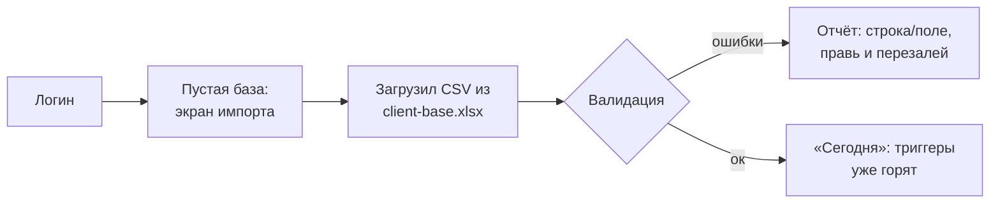
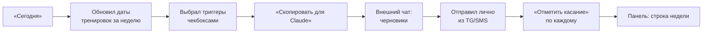
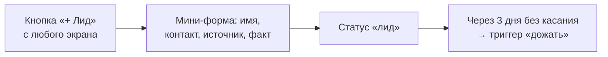
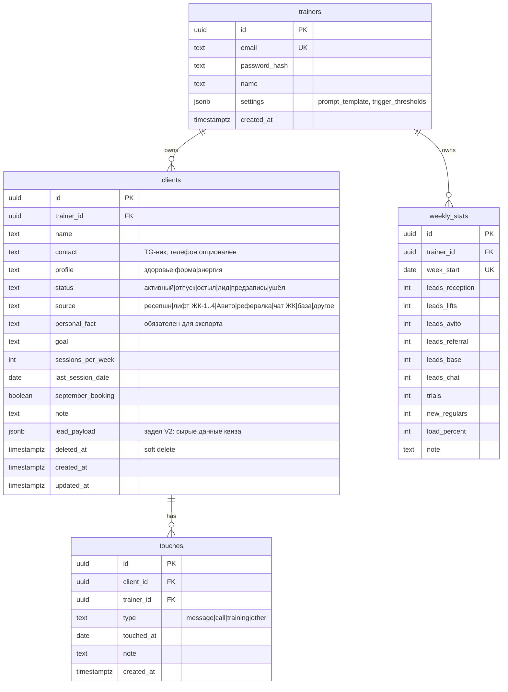

# MVP-спецификация: «Штаб» — админка тренера

**Продукт одним предложением:** веб-версия пятничного ритуала — база клиентов с автоматическими триггерами «кому пора
написать» и выгрузкой строк для генерации черновиков в Claude; ни один клиент не теряется тихо.

Дата: 12.06.2026 · Стек (зафиксирован пользователем): Next.js (App Router) + TypeScript + Tailwind + NextAuth +
Drizzle + Neon Postgres + Vercel
Источники: брендбук v2.0 · `sigma/00-strategy.md` (ред. 2) · `sigma/05-activate/client-base.xlsx` (эталон логики) ·
`reactivation-prompt.md`

**Когда строим (рамка из стратегии):** после деплоя лендинга и запуска трека 0. Excel работает с первого дня, «Штаб»
строится параллельно в июле и забирает базу импортом. Маркетинговые вехи плана важнее кода — если горит веха, код ждёт.

---

## Core-фичи (5, оценка: 2–3 недели вечерами с AI)

| # | Фича                                                                                                                                                                                                                                                    | Боль (источник)                                                                                                                       | Критерий готовности                                                                                           | Сложность |
|---|---------------------------------------------------------------------------------------------------------------------------------------------------------------------------------------------------------------------------------------------------------|---------------------------------------------------------------------------------------------------------------------------------------|---------------------------------------------------------------------------------------------------------------|-----------|
| 1 | **База клиентов**: CRUD + поиск/фильтр по статусу/профилю/триггеру + **импорт из client-base.xlsx (CSV)**                                                                                                                                               | «никто вовремя не замечает, что человек пропал» (статья-кейс); переезд с Excel должен быть бесшовным — это наш «импорт от конкурента» | Все 15 колонок Excel переносятся импортом без ручной правки; карточка редактируется с телефона                | M         |
| 2 | **Триггеры**: вычисляются на лету по логике эталона: лид без касания 3+ дн · отпуск без предзаписи · активный 10/21+ дн без тренировки · остывший 30+ дн без касания · **«🔇 тихий»: любой неушедший без касания 45+ дн** (страховка от «тихой потери») | вся ценность системы; «дыра в выручке — клиент выпал из поля зрения»                                                                  | Триггеры байт-в-байт совпадают с Excel-логикой на golden-тестах (10 кейсов); пороги — в настройках, не в коде | M         |
| 3 | **Экран «Сегодня»** + **экспорт для Claude**: список триггеров по приоритету → чекбоксы → «Скопировать для Claude» кладёт в буфер промпт (из настроек) + выбранные строки **без контактов и телефонов**                                                 | пятничный ритуал — главный сценарий; «узкий коридор данных» — ПДн не покидают систему                                                 | Вставил буфер в чат Claude — черновики генерируются без правки формата                                        | S         |
| 4 | **Журнал касаний**: «отметить касание» (тип: сообщение/звонок/тренировка, дата, заметка) из «Сегодня» и из карточки; касание гасит триггер                                                                                                              | замыкание цикла: «отправил — отметили»; без этого триггеры орут вечно                                                                 | Касание в 2 тапа с телефона; триггер пересчитывается мгновенно; история видна в карточке                      | S         |
| 5 | **Панель**: живые счётчики (активные, предзаписи, лиды, триггеры по типам) + пятничная строка недели (заявки по 6 источникам, пробные, постоянные, загрузка %)                                                                                          | приборная панель из launch-plan; «какой канал кормить деньгами»                                                                       | Паритет с листом «Панель» Excel; строка недели заполняется ≤5 мин                                             | S         |

**Адаптация обязательных не-фич** (внутренний инструмент, не SaaS): self-serve регистрация и оплата — не применимо (один
пользователь); онбординг ≤10 мин = **вход → импорт CSV → экран «Сегодня» с живыми триггерами** — это и есть первая
ценность.

## V2 (после того, как ритуал прожил месяц в проде)

- **Приём лидов с лендинга**: POST `/api/leads` (токен) — квиз/слот пишут лидов напрямую в БД. Закрывает риск №1
  стратегии (зависимость воронки от Telegram). Схема готова с v1 — см. `clients.source` + `lead_payload`.
- Встроенная LLM-генерация черновиков (один вызов API, человек правит в UI).
- Напоминание о пятничном ритуале (email или web-push).
- Мультитенантность: регистрация тренеров, изоляция по `trainer_id` (уже в каждой таблице), биллинг. Это отдельный
  продукт — сначала sigma-scan.
- Когортная аналитика клиентов (месяц прихода → удержание).

## Никогда (защита scope)

- **Автоотправка сообщений клиентам** — ломает «человек в контуре» и сам бренд («тренер, который держит» не делегирует
  отношения роботу).
- **TG-бот-рассыльщик** — решение отклонено в стратегии: инфраструктура на замедленной платформе, отрицательная
  окупаемость на 30–40 клиентах.
- **Расписание, абонементы, платежи** — касса и запись живут на ресепшне СК; дублировать чужую зону = два источника
  правды.
- **CRM-зоопарк** (kanban сделок, скоринг, теги без лимита) — у тренера 40 клиентов, а не отдел продаж.

---

## User flows

### Flow 1 — Вход → первая ценность (≤10 минут)

Стартовое состояние: пустая БД. Конечная ценность: список «кому написать» из своих данных. Что может пойти не так:
кривой CSV (кириллица/даты) → парсер терпим к форматам дат Excel, отчёт об ошибках построчно, никогда не импортируем
«частично молча».

### Flow 2 — Пятничный ритуал (основной, еженедельный)

Конечная ценность: ноль потерянных клиентов + панель заполнена. Риск: ритуал умирает от трения → каждый шаг ≤3 кликов,
мобильная вёрстка обязательна.

### Flow 3 — Новый лид (с ресепшна/QR/Авито, вручную в v1)

Риск: тренер в зале, заполнять некогда → форма из 4 полей, остальное потом.

### Flow 4 — Критический сценарий: «тихая потеря»

Клиент без статуса «ушёл» давно не появлялся и о нём забыли — то, из-за чего теряют деньги все (кейс-статья). Защита:
триггер «🔇 тихий» (45+ дней без касания, любой статус кроме «ушёл») не имеет условий-исключений и не гасится ничем,
кроме касания или статуса «ушёл». Это последний рубеж системы.

---

## Схема данных

Решения по схеме: `trainer_id` в каждой таблице с первого дня (мультитенантный задел без миграционной боли) ·
`last_contact` НЕ хранится — выводится как `max(touches.touched_at)`, один источник правды · триггеры НЕ таблица, а
чистая функция `computeTrigger(client, lastTouch, thresholds)` — одна на сервер и golden-тесты · soft delete только у
`clients` (туда смотрит «🔇 тихий») · аудит-таблица не нужна одному пользователю — `touches` + `updated_at` покрывают
вопрос «что происходило».

---

## Экраны (mobile-first: тренер — в зале со смартфоном)

| # | Экран                                                 | Назначение                                                                              | Состояния                                                                                                                                  | Приоритет |
|---|-------------------------------------------------------|-----------------------------------------------------------------------------------------|--------------------------------------------------------------------------------------------------------------------------------------------|-----------|
| 1 | `/login`                                              | вход (NextAuth credentials)                                                             | ошибка «Не подошло. Проверь и попробуй ещё раз» — без деталей, что именно неверно                                                          | P0        |
| 2 | `/today` «Сегодня»                                    | триггеры по приоритету, чекбоксы, primary-CTA «Скопировать для Claude», быстрое касание | **пусто: «Триггеров нет. База под контролем — так держать.»** · загрузка skeleton · после копирования — тост «В буфере. Вставляй в Claude» | P0        |
| 3 | `/clients`                                            | таблица базы: поиск, фильтры, «+ Клиент», «+ Лид», импорт CSV                           | пусто: «База пустая. Импортируй таблицу или добавь первого клиента» + 2 CTA                                                                | P0        |
| 4 | `/clients/[id]` (drawer на десктопе, экран на мобиле) | карточка: все поля + история касаний + «отметить касание»                               | personal_fact пустой → жёлтая плашка «Без личного факта сообщение не соберётся»                                                            | P0        |
| 5 | `/dashboard` «Панель»                                 | счётчики «сейчас» + таблица недель + форма строки                                       | пусто: «Первая пятница ещё впереди»                                                                                                        | P1        |
| 6 | `/settings`                                           | промпт-шаблон (textarea), пороги триггеров, смена пароля                                | дефолты = reactivation-prompt.md и пороги Excel                                                                                            | P1        |

## Тарифы → стоимость владения (внутренний инструмент)

Vercel Hobby — 0 ₽ · Neon Free (0.5 GB — хватит на тысячи клиентов) — 0 ₽ · домен/поддомен лендинга — ~0 ₽. Итого: **0
₽/мес**. Решение: никакой монетизации в v1; вопрос «продукт для тренеров» открывается только через sigma-scan после
15.09.

## План событий аналитики (адаптация: метрика одна — живёт ли ритуал)

Внешняя аналитика не нужна — всё выводимо из собственных данных:

| Вопрос                | Метрика                                    | Откуда                                                      |
|-----------------------|--------------------------------------------|-------------------------------------------------------------|
| Ритуал живёт?         | недель подряд с заполненной строкой панели | `weekly_stats`                                              |
| Система используется? | касаний/неделю, экспортов/неделю           | `touches`; счётчик экспорта — поле в `weekly_stats` или лог |
| Триггеры не копятся?  | средний возраст непогашенного триггера     | вычисляется                                                 |

Правило из launch-plan действует и тут: 3 пустые пятницы подряд = инструмент мёртв, возвращаемся в Excel и не страдаем.

## Нефункциональные требования

- **Безопасность:** все маршруты кроме `/login` за middleware-сессией; argon2/bcrypt; rate-limit на `/login` (5/мин);
  валидация на сервере (zod) для каждого action; экспорт для Claude никогда не включает `contact` — проверяется тестом.
- **ПДн (152-ФЗ), честный флаг:** данные клиентов на Neon = зарубежный хостинг — для внутреннего учёта серая зона.
  Митигация v1: минимизация — телефон опционален, можно вести только TG-ники и имена. Альтернатива при желании спать
  спокойно: Postgres в Yandex Cloud (меняется одна строка подключения — Drizzle не привязан). Решение за тобой к началу
  разработки.
- **Производительность:** на 40–200 клиентах вопросов нет; триггеры считаются в одном запросе с `LEFT JOIN LATERAL` по
  последнему касанию.
- **Мобильность:** mobile-first 360px; «отметить касание» и «+ Лид» — главные мобильные сценарии.

## Открытые вопросы

| Вопрос                                           | Кто решает                    | К какой неделе |
|--------------------------------------------------|-------------------------------|----------------|
| Хостинг БД: Neon или Yandex Cloud (ПДн)          | ты                            | до старта кода |
| Поддомен: `admin.{домен-лендинга}` или отдельный | ты                            | к деплою       |
| Web-push о пятнице — нужен ли вообще (V2)        | по факту месяца использования | после 15.09    |
